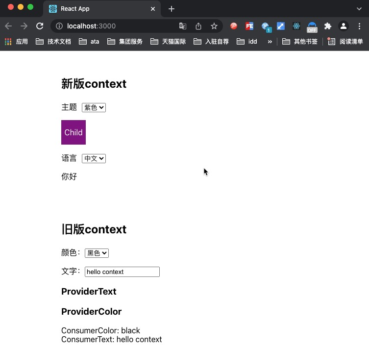

# 我的笔记

## 0、参考文章
[react源码学习环境搭建](https://segmentfault.com/a/1190000020239791)  
[搭建源码调试环境](https://github.com/neroneroffy/react-source-code-debug/blob/master/docs/setUpDebugEnv.md)
## 1、安装环境
> 推荐:node14.15.0

```
cnpm i  // 速度更快
npm run dev:17
```
运行成功后

